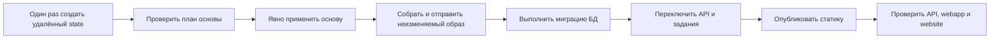

# Деплой

Production-инфраструктура описана в [infra/README.md](../infra/README.md). Выбери хостинг по [CHECKLIST.md](../CHECKLIST.md): Yandex Cloud для пользователей/данных в России, иначе DigitalOcean. Свой сервер — только по явному запросу полного контроля. Локальной разработке облачные ключи не нужны.

Инструкции провайдеров: [DigitalOcean](DIGITALOCEAN.md), [Yandex Cloud](YANDEX_CLOUD.md).

## Состав production

| Область | DigitalOcean | Yandex Cloud |
| --- | --- | --- |
| API | Сервис App Platform | Serverless Container за API Gateway |
| Задания | Scheduler worker App Platform | Четыре HTTP-контейнера с таймерами |
| БД | Managed PostgreSQL 18 | Managed Service for PostgreSQL 18 |
| Статика | App Platform Static Sites | Два публичных website-бакета Object Storage |
| Файлы пользователей | Приватный Space с версиями | Приватный Object Storage с версиями |
| Образы | DigitalOcean Container Registry | Yandex Container Registry |
| Terraform state | Приватный Space с версиями | Приватный Object Storage с версиями |
| CDN | Встроенная доставка Static Sites | Отключён; Cloud CDN по необходимости |
| Уведомления | App Platform через Terraform | Monitoring вручную по инструкции |

Начальный профиль содержит один узел БД и один API-экземпляр DigitalOcean (`instance_count = 1`). Это экономный старт, не высокая доступность. До роста требований увеличь размер и число реплик.

Serverless Containers Yandex масштабируются на несколько процессов. `concurrency` задаёт запросы на экземпляр, а не предел экземпляров. Поэтому Yandex использует `RATE_LIMIT_STORE=database`. Auth/admin-лимиты из `backend/src/http/security.ts` считают в `rate_limit_buckets` через `backend/src/rate-limit`: один upsert на политику, клиента и фиксированное окно.

Так `AUTH_RATE_LIMIT_MAX` (вход), `API_RATE_LIMIT_MAX` (данные приложения после входа, по умолчанию 600 в минуту) и `ADMIN_USERS_READ_RATE_LIMIT_MAX` остаются общими. DigitalOcean с одним процессом использует `memory` без запросов к БД. На своём сервере с несколькими API-процессами также включи `database`. Отработанные окна удаляет auth-очистка в `maintenance:process`. Причина выбора PostgreSQL вместо Redis — в `docs/ARCHITECTURE.md`.

Облачным путям Ansible не нужен: отдельных хостов для настройки нет. Terraform управляет ресурсами; скрипт релиза — образом, порядком миграции, статикой и проверкой. Ansible может пригодиться на своём сервере.

Используются минимальные уведомления провайдера без нового сервиса. Они не читают числа outbox из обычного лога. Покрытие и ручные проверки описаны в разделе наблюдения `docs/BACKGROUND_JOBS.md`.

## Порядок релиза



State основы и релиза разделены. Постоянные ресурсы меняет `infra:apply`. `release` требует план основы без изменений. Корни релиза допускают безопасный повтор. Ошибка миграции останавливает работу до переключения runtime и статики.

Перед реальными apply, release и импортом вне bootstrap берётся общая аренда в Terraform state `operations`. Её процесс живёт всю последовательность и завершается вместе со скриптом. Второй запуск останавливается на блокировке, не перемешивая изменения корней.

Скрипт проверяет владение до и после каждой фазы изменений. Потеря аренды останавливает остаток последовательности. Plan, output, dry-run и bootstrap сохраняют блокировки своих корней.

## Требования

Для обоих облаков:

- Terraform `>= 1.15, < 2`, Bun, Docker, Git и production-ветка, отправленная в upstream.
- Три HTTPS-домена: API, webapp и website.
- Случайный JWT-секрет из 64 шестнадцатеричных символов: `openssl rand -hex 32`.
- Ключи провайдера с правами выбранного Terraform-стека.

Yandex также требует `yc`, AWS CLI и три ID сертификатов Certificate Manager. DigitalOcean — `doctl`, доступ App Platform к нужному GitHub-репозиторию и ключи управления Spaces. Подробности — в инструкции провайдера.

## Настройка и bootstrap

Скопируй примеры только выбранного провайдера. Эти локальные файлы игнорируются Git:

```bash
cp infra/<provider>/bootstrap/terraform.tfvars.example infra/<provider>/bootstrap/terraform.tfvars
cp infra/<provider>/production/terraform.tfvars.example infra/<provider>/production/terraform.tfvars
```

Заполни их и передай секретные `TF_VAR_*` по инструкции. Создай удалённый state и ограниченный ключ:

```bash
bun run infra:bootstrap -- <digitalocean|yandex> --new --dry-run
bun run infra:bootstrap -- <digitalocean|yandex> --new
bun run infra:apply -- <digitalocean|yandex> --dry-run
bun run infra:apply -- <digitalocean|yandex>
```

Первый bootstrap начинает с локального state, создаёт приватный версионируемый бакет и ключ, затем переносит state в S3-backend. Старые версии удаляются через 30 дней, незавершённые multipart-загрузки — через 7. Текущие версии не истекают.

Это ограничивает накопление старых state/lock-объектов. На Yandex без очистки можно заполнить `max_size` и потерять возможность взять блокировку. Существующая установка получает правило после повторного `infra:bootstrap -- <provider>`.

В Yandex для создания и настройки state-бакета временно выдаётся folder-level `storage.admin`. Команда устанавливает политику выделенного state-аккаунта, снимает широкую роль, затем переносит state.

Политика разрешает чтение конфигурации бакета и работу с текущими state/lock-объектами. Она запрещает `s3:DeleteBucket`, `s3:PutBucketVersioning` и не разрешает удалять версии. Версионирование включается до политики, поэтому обычный apply не блокируется.

Deny защищает от изменения Terraform, не от владельца ключа с правом менять политику. Yandex проверяет управление политикой через IAM; S3 API требует `storage.admin`. Такой владелец может снять Deny.

У state-аккаунта в обычном режиме нет IAM-роли. Поэтому обновление политики существующей установки может быть отклонено, хотя plan покажет изменение: отказ чтения провайдер воспринимает как пустую политику.

При таком отказе добавь `bootstrap_folder_storage_access = true` в `infra/yandex/bootstrap/terraform.tfvars` и повтори bootstrap. Скрипт временно выдаст роль и снимет её в той же команде, затем попросит удалить строку. Если отказ повторился сразу после выдачи, дождись распространения IAM и повтори с той же строкой.

Обычный повтор и `--dry-run` разрешают удаление только этой известной временной привязки без отдельного флага. Широкая роль не должна пережить следующий запуск. Восстановление `--recover-state-*` запрещено, пока строка присутствует.

Bootstrap создаёт игнорируемые файлы с правами `0600`:

- `infra/<provider>/.env.terraform-state`: ограниченные ключи backend.
- `infra/<provider>/*/backend.backend.hcl`: endpoint, бакет и ключ state без секретов.

Если процесс остановился до переноса, повтори команду без `--new`. Оставшийся `terraform.tfstate` — источник истины. Скрипт продолжает `-migrate-state`, проверяет удалённые выходы и только затем удаляет локальный state. Один файл ключей не доказывает готовность backend.

Сохрани env-файл state в менеджере секретов. Если пропали он и локальный bootstrap-state, скрипт не создаёт второй backend.

Для DigitalOcean восстановление требует временный ключ к существующему Space. Для Yandex создай ключ именно на `<project_slug>-tf-state`. Другая личность не пройдёт bucket policy, даже с широкой folder-ролью. Сохрани ID ресурса ключа для отзыва и выданные один раз ID/секрет:

```bash
export TF_STATE_RECOVERY_ACCESS_KEY_ID='<temporary key id>'
export TF_STATE_RECOVERY_SECRET_ACCESS_KEY='<temporary key secret>'
bun run infra:bootstrap -- <provider> \
  --recover-state-bucket=<existing-state-bucket> \
  --recover-state-region=<existing-bucket-region>
unset TF_STATE_RECOVERY_ACCESS_KEY_ID TF_STATE_RECOVERY_SECRET_ACCESS_KEY
```

Команда проверяет существующий bootstrap-state, согласует управляемый ключ и проверяет его на том же бакете. Затем переинициализирует корни и записывает файл готовности. После успеха сразу отзови временный ключ; в Yandex: `yc iam access-key delete <recovery-access-key-resource-id>`.

При прерывании повтори команду с тем же ключом. Backend-конфигурация записывается первой, временные секреты остаются только в памяти, поэтому файл готовности не помешает повтору. У восстановления нет dry-run; нужны обычные права apply bootstrap.

Первый Yandex foundation apply также временно выдаёт storage-аккаунту folder-level `storage.admin`. После создания трёх бакетов команда оставляет роль только на этих бакетах и снимает общую. Ключи публикатора и media имеют более узкие права.

Повтор автоматически допускает удаление только этой временной привязки. Обычный план требует её отсутствия. Итоговый IaC-ключ не читает и не повреждает отдельный state-бакет.

Политики бакетов запрещают IaC-ключу `s3:DeleteBucket` и `s3:PutBucketVersioning`. Второй запрет останавливает приостановку версионирования через Terraform. Удаление бакета и правка политики проверяются через IAM, где остаётся bucket-level `storage.admin`. Поэтому Deny не защищает от самого владельца ключа.

Два статических бакета разрешают только анонимное чтение объектов. После первого релиза каждый `infra:apply` проверяет маркер, `/` обоих доменов и отсутствующий путь webapp. Отсутствие страницы или SPA-оболочки завершает команду ошибкой. Полная граница и откат описаны в `docs/YANDEX_CLOUD.md`.

## План и релиз

Проверить основу и уже созданные корни релиза:

```bash
bun run infra:plan -- <digitalocean|yandex>
```

Выполнить релиз:

```bash
bun run release -- <digitalocean|yandex> --dry-run
bun run release -- <digitalocean|yandex>
```

Перед реальным релизом скрипт читает ветку и GitHub-репозиторий DigitalOcean из применённого state основы, получает upstream и запрещает:

- Detached HEAD, грязную, неопубликованную, отстающую или неверную ветку/upstream.
- DigitalOcean-репозиторий upstream, отличный от `github_repo`.
- DigitalOcean-команду, отличную от неизменяемого `DO_EXPECTED_TEAM_UUID`.
- Cloud/folder Yandex CLI, отличные от `terraform.tfvars`.
- Удаление или замену PostgreSQL, media-бакета, registry, Lockbox и state.
- Другие удаления без точного `--allow-destroy=<address>`.

Docker и статика Yandex собираются из `git archive` зафиксированного 40-символьного коммита. Статика DigitalOcean — из неизменяемой `infra-release/<sha>`. Перед успехом проверяется `source_commit_hash` обоих приложений.

Поздний push в исходную ветку не меняет захваченный коммит и не прерывает переключение после миграции. `--allow-destroy` не отменяет защиту постоянных ресурсов. Вместо замены импортируй или перемести существующий ресурс.

## Секреты и state

Не коммить `.tfvars`, ключи backend/провайдера, auto-variable-файлы или Terraform-планы. State содержит секреты. Бакет и его ключ — production-доступ, не артефакты сборки.

Передавай секреты через `TF_VAR_*` или локальный игнорируемый `terraform.tfvars`. Примеры намеренно не задают секретные поля: даже пустое значение в tfvars имеет приоритет над окружением. Runtime получает БД, JWT, media и почту через secret-поля провайдера или Lockbox. В образ они не входят.

Yandex использует владельца БД только для миграций и две DML-роли `blue`/`green`. У каждого слота постоянная точная версия Lockbox. Runtime сообщает активный слот из своего отдельного state.

До плана основы скрипт сравнивает версию и отпечаток пароля активного слота с прежним state. Заменять его запрещено. Обнови и выбери неактивный слот, примени основу, затем выполни релиз. При неудаче старый runtime сохранит логин и секрет. Команды — в [YANDEX_CLOUD.md](YANDEX_CLOUD.md).

## Импорт ручной инфраструктуры

Не применяй первую основу поверх ресурсов старых CLI-инструкций. Сначала найди реальные ID и импортируй каждый в нужный корень/адрес:

```bash
bun run infra:import -- <provider> bootstrap <terraform-address> <provider-resource-id>
bun run infra:import -- <provider> foundation <terraform-address> <provider-resource-id>
bun run infra:plan -- <provider>
```

Bootstrap можно импортировать в локальный state до ключей backend; следующий bootstrap перенесёт его. Для корней релиза нужны точные неизменяемые параметры:

```bash
bun run infra:import -- digitalocean runtime digitalocean_app.api <app-id> \
  --runtime-image-digest=sha256:<64-hex>
bun run infra:import -- digitalocean static digitalocean_app.webapp <app-id> \
  --release-revision=<40-char-sha> --source-branch=infra-release/<40-char-sha>
bun run infra:import -- yandex migration yandex_serverless_container.migration <container-id> \
  --runtime-image-digest=sha256:<64-hex>
bun run infra:import -- yandex runtime yandex_serverless_container.api <container-id> \
  --runtime-image-digest=sha256:<64-hex>
```

Скрипт создаёт временные параметры, импортирует ресурс и проверяет сохранённый план. Используй текущий формат import ID провайдера. Импортируй связанные таймеры и статические приложения до признания плана чистым. Совпадение имени не доказывает владение.

`digitalocean_spaces_key` и `yandex_iam_service_account_static_access_key` импортировать нельзя: закреплённые провайдеры этого не поддерживают, а секрет выдаётся только при создании. Скрипт запрещает такие адреса.

Импортируй бакет, аккаунт, Lockbox и политику. Создай новый ключ через Terraform. Примени основу/релиз, проверь state, media и статику, затем отзови старый. Старый ключ state отзывай только после второго успешного init/plan с новым.

Скрипт также защищает активные media-ключи, ключ Postbox и версию БД/JWT Yandex даже при `--allow-destroy`. Они соединяют разные state: прямая замена отозвала бы доступ до переключения API/заданий.

Для ротации сначала добавь второй ключ/слот, примени только добавление, выполни и проверь релиз. Старый ключ убери отдельным проверенным изменением основы. Не ослабляй список защиты ради одного apply.

Импорт БД не меняет владельцев существующих объектов. Перед первой миграцией проверь public-схему через привилегированное старое подключение. URL хранится только в окружении:

```bash
export DATABASE_URL='<legacy owner or privileged connection URL>'
export DATABASE_LEGACY_OWNER='<owner reported by the inventory>'
export DATABASE_MIGRATION_USER='<new migration owner from Terraform>'
bun run --cwd backend db:adopt-owner
```

Команда только читает таблицы, sequences, views, routines, enums/domains и схему с другим владельцем. Объекты расширений исключены. Смешанные старые владельцы запрещены. Проверь список, затем один раз передай владение:

```bash
export CONFIRM_DATABASE_OWNER_ADOPTION="${DATABASE_LEGACY_OWNER}->${DATABASE_MIGRATION_USER}"
bun run --cwd backend db:adopt-owner -- --apply
unset DATABASE_URL DATABASE_LEGACY_OWNER DATABASE_MIGRATION_USER CONFIRM_DATABASE_OWNER_ADOPTION
```

`db:deploy` выполняет ту же проверку до Prisma и останавливается, если перенос пропущен. После каждой миграции он снимает у `PUBLIC` создание в public-схеме, временные таблицы, права на объекты/routines и соответствующие default privileges.

Runtime-пользователь DigitalOcean не может иметь повышенные атрибуты, наследуемые роли или собственные объекты. Его прямые права пересоздаются как CONNECT, schema USAGE, table DML и использование sequences.

Проверка и согласование ACL идут в одной транзакции. Ошибка выдачи прав не оставит runtime с уже отозванными прежними правами.

## Откат и восстановление

Откат приложения — новый коммит, обычно revert, и обычный релиз. Не направляй сервис на изменяемый tag. Миграции идут вперёд; используй совместимые expand/contract, чтобы прежняя версия приложения могла работать при откате.

При внешнем DNS первый apply может создать ресурс и упасть только на проверке URL. Выполни `bun run infra:output -- yandex`, прочитай `required_dns_records`, измени DNS и дождись распространения. Повтори релиз, не пересоздавай ресурсы. Output выдаёт только разрешённые параметры, без ключей публикатора.

При ошибке apply исправь конфигурацию владельца и повтори plan. Не правь state вручную, не удаляй блокировку и не используй `-target` как обычный деплой.

Если сбой машины оставил `operations` заблокированным, сначала убедись, что процессы `scripts/infra.mjs`, Terraform и держатель аренды завершены. Инициализируй `infra/<provider>/operations` с созданными backend-настройками и state-ключом. Затем выполни `terraform force-unlock <LOCK_ID>` только с ID этой operations-блокировки из вывода Terraform. Не снимай блокировку живого процесса или другого корня.

## Свой сервер

Этот путь отделён от двух облачных стеков:

- Собери `backend/Dockerfile`, запусти PostgreSQL 18+.
- До переключения выполни `bun run --cwd backend db:deploy`.
- Раздавай `webapp/dist` и `website/dist` через Caddy/nginx.
- Запусти `bun run --cwd backend start:scheduler` под supervisor.
- Подключи приватный S3-совместимый media-бакет.

После обеих статических сборок выполни `bun run static:precompress`. Caddy использует `precompressed`; nginx — `gzip_static` для `.gz` и `brotli_static` из `ngx_brotli` для `.br`. Обычный nginx сам `.br` не отдаёт.

Облачные релизы не читают эти файлы: Yandex собирает Git-архив через `infra/yandex/static.Dockerfile`, DigitalOcean — через App Platform. Не включай precompress в облачные команды.

Ansible используй для повторяемой настройки пакетов, пользователей, firewall, systemd и proxy. Не помещай данные БД, секреты и релизы в шаблоны playbook. Оператор отвечает за TLS, резервные копии, проверку восстановления, обновления, мониторинг и откат.

## Локальные проверки

Тесты не меняют облако. Перед явным релизом проверь приложение и Terraform, затем выполни настоящий plan:

```bash
bun run check
bun run test:terraform
```

`test:terraform` инициализирует каждый корень с `-backend=false` в отдельном временном каталоге. Ключи backend не нужны; production-state недоступен. Первая загрузка провайдеров требует сети.

Перед релизом выполни `infra:plan` с реальными ключами. Mock-тест доказывает форму конфигурации; только реальный план проверяет лимиты аккаунта, регионы, домены и текущее облачное состояние.
